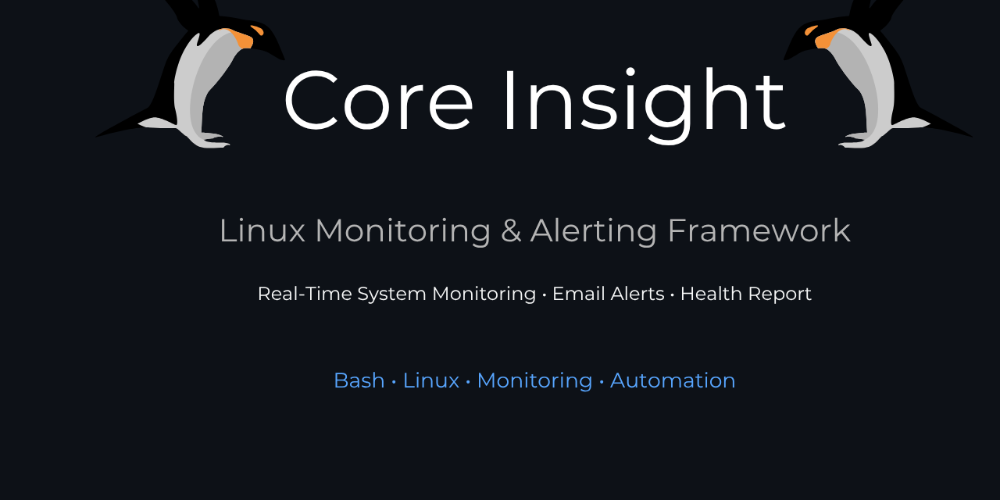

<p align="center">
  
</p>

<h1 align="center">Core Insight</h1>

<p align="center">
  Linux Monitoring & Alerting Framework
</p>

<p align="center">
  
  
  
  
  
  
</p>

<p align="center">
  <strong>A lightweight Linux System Monitoring and Alerting Framework built entirely with Bash scripting.</strong>
</p>

<p align="center">
  Real-Time Monitoring • Email Alerts • Daily Health Reports • Service Recovery • Automation
</p>

---
# Core Insight

A lightweight Linux-based System Monitoring and Alerting Framework built entirely with Bash scripting.

Core Insight was developed as a hands-on Linux System Administration and Monitoring project to strengthen practical skills in Bash scripting, automation, system monitoring, networking, and infrastructure management. The project continuously monitors system health, generates reports, sends email alerts, and provides an interactive dashboard for administrators.

The primary objective was to build a monitoring solution from scratch without relying on external monitoring platforms such as Nagios, Zabbix, or Prometheus.

---

## Features

### System Monitoring

* CPU Usage Monitoring
* RAM Usage Monitoring
* Disk Usage Monitoring
* Network Connectivity Monitoring
* Service Status Monitoring
* Process Monitoring
* System Uptime Monitoring

### Alerting

* Threshold-Based Alerts
* Email Notifications using Brevo SMTP
* Automatic Service Recovery Notifications

### Reporting

* Automated Health Report Generation
* Daily Health Reports
* Centralized Logging

### Dashboard

* Interactive Menu-Based Dashboard
* Real-Time Monitoring Checks
* Log Viewer

### Automation

* Auto-Restart Services
* Cron Integration Ready
* Automated Daily Report Delivery

---

## Why I Built Core Insight

As a Computer Science student interested in Linux Administration, Cyber Security, and Network Security, I wanted to gain practical experience beyond coursework.

Core Insight allowed me to explore:

* Bash Scripting
* Linux System Administration
* Process and Service Management
* Email Automation
* Network Diagnostics
* Monitoring System Design
* Incident Detection and Response

Instead of using existing monitoring tools, I chose to design and implement the monitoring workflow myself to better understand how enterprise monitoring systems operate behind the scenes.

---

## Technical Skills Demonstrated

### Linux Administration

* Process Monitoring
* Service Monitoring
* Systemd Integration
* Log Management
* Cron Job Automation

### Networking

* ICMP Connectivity Testing
* Packet Loss Detection
* Network Latency Monitoring

### Automation

* Email Alerting
* Automated Health Reports
* Automatic Service Recovery

### Scripting

* Bash Functions
* Configuration Management
* File Handling
* Error Handling
* Modular Script Design

---

## Architecture

Core Insight follows a modular monitoring architecture:

```text
Monitoring Modules
        │
        ▼
Threshold Evaluation
        │
        ▼
Alert Engine
        │
        ├── Email Notifications
        ├── Log Storage
        ├── Report Generation
        └── Service Recovery
```

---

## Monitoring Workflow

1. Collect system metrics.
2. Compare values against configured thresholds.
3. Trigger alerts when thresholds are exceeded.
4. Record events in monitoring logs.
5. Generate health reports.
6. Notify administrators via email.
7. Attempt service recovery when applicable.

---

## Project Structure

```text
core_Insight/
│
├── configs/
│   └── threshold.conf
│
├── logs/
│   └── monitor.log
│
├── reports/
│   └── report_*.txt
│
├── scripts/
│   ├── cpu_check.sh
│   ├── ram_check.sh
│   ├── disk_check.sh
│   ├── network_check.sh
│   ├── service_check.sh
│   ├── process_check.sh
│   ├── uptime_check.sh
│   ├── auto_restart.sh
│   ├── report_generator.sh
│   ├── daily_health.sh
│   ├── mail_alert.sh
│   └── main_screen.sh
│
└── README.md
```

---

## Requirements

* Linux 
* Bash
* systemd
* msmtp
* Brevo SMTP Account

Install dependencies:

```bash
sudo apt update
sudo apt install msmtp msmtp-mta mailutils
```

---

## Configuration

Configure monitoring thresholds inside:

```bash
configs/threshold.conf
```

Example:

```bash
CPU_THRESHOLD=80
RAM_THRESHOLD=80
DISK_THRESHOLD=85
```

Configure SMTP credentials:

```bash
~/.msmtprc
```

---

## Running Core Insight

Launch the interactive dashboard:

```bash
cd scripts
./main_screen.sh
```

---

## Email Alert System

Core Insight supports automated alerts for:

* CPU Threshold Violations
* RAM Threshold Violations
* Disk Threshold Violations
* Network Connectivity Failures
* Service Recovery Events
* Daily Health Reports

All alerts are delivered through SMTP using Brevo.

---

## Daily Health Reports

Generate a report manually:

```bash
./daily_health.sh
```

Schedule automatic report delivery using cron:

```bash
0 8 * * * /path/to/core_Insight/scripts/daily_health.sh
```

---

## Sample Output

### CPU Monitoring

```text
Environment : Linux
Hostname    : PAHADImirg
CPU Usage   : 95%
Threshold   : 80%
Status      : CRITICAL

ALERT: CPU threshold exceeded!
```

### Network Monitoring

```text
Status      : CONNECTED
Packet Loss : 0%
Latency     : 21 ms
Quality     : EXCELLENT
```

---

## Challenges Solved

During development, the following technical challenges were addressed:

* SMTP Email Integration using Brevo
* Linux Service Monitoring and Recovery
* Cross-Module Logging
* Automated Report Generation
* Threshold-Based Alerting
* Interactive Dashboard Design
* Bash Script Modularization

---

## Learning Outcomes

This project improved my understanding of:

* Linux Internals
* Monitoring System Design
* Automation Workflows
* Shell Scripting Best Practices
* Infrastructure Reliability
* Incident Detection and Response

---

## Future Roadmap

### Core Insight v2.0

* Historical Metrics Tracking
* Security Audit Module
* Telegram Notifications
* AI Health Summary
* Docker Monitoring
* Web Dashboard
* Grafana Integration

---

## Screenshots

Add project screenshots here:

* Dashboard Interface
* CPU Monitoring Module
* RAM Monitoring Module
* Email Alert Example
* Daily Health Report

---

## Author

Developed by Pranjal Shridhar Verma

Computer Science Student

Areas of Interest:

* Linux Administration
* Cyber Security
* Network Security
* Automation
* System Monitoring

---
## 📦 Installation

Clone the repository:
git clone https://github.com/PranjalShridhar316/Core_Insight.git
cd Core_Insight
---
## License

This project is licensed under the MIT License.
